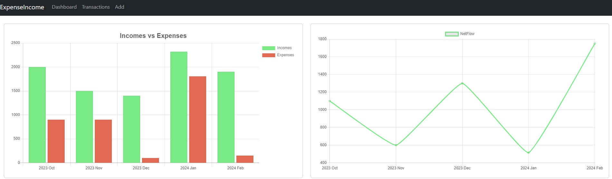
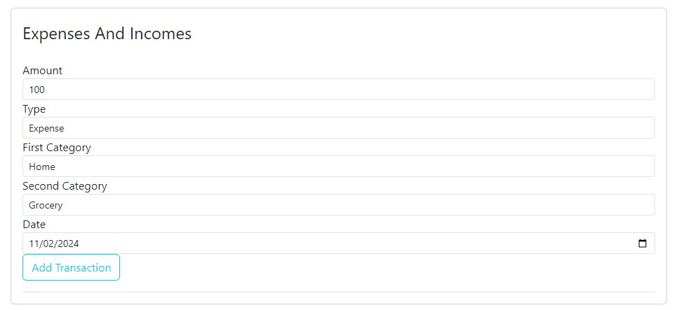
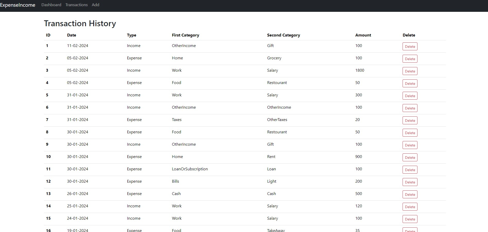

# Personal-Finance-Manager
## A tool to manage your personal finance everywhere

## Financial Dashboard
In the dashboard page it's present a dashboard that displays income and expense data. 

It has several graphs: 
- The bar graph titled "Incomes vs Expenses" shows the income and expense amounts over months. 
- The line graph titled "NetFlow" shows the net flow of income and expenses over the same time period.

The dashboard also displays income and expense data for a specific month. 

The upper section titled "Expenses per Categories" shows two charts for expenses:
- A pie chart that breaks down the total expenses into different categories (Cash, Taxes, Groceries, etc.) for the selected month.
- A bar chart that shows the amount spent in each expense category for the selected month.

The lower section titled "Incomes per Categories" shows two charts for income:
- A pie chart that breaks down the total income into different categories (Salary, Gifts, etc.) for the selected month.
- A bar chart that shows the amount received in each income category for the selected month.

The dashboard displays data for a user-selected month. By default, the current month is chosen, but users can switch to a different month using a selection tool 

## Add Transaction Form

The form allows users to add new transactions to the financial dashboard. The data is stored in a SQLite database. Here are the fields users can fill out:
- Amount: This field allows users to enter the transaction amount.
- Type: This field allows users to specify whether the transaction is an expense or income.
- Category: This section likely consists of two dropdown menus, allowing users to select a primary category and a secondary category for the transaction.
- Date: This field allows users to enter the date of the transaction.
- Add Transaction: Once users have filled out the form, they can click this button to submit the transaction and add it to the database.

## Transaction History Table

The Transaction page shows a table that displays the user's transaction history. 

The table is ordered by date, with the most recent transactions at the top. Each row in the table represents a single transaction and includes the following information:
- ID: A unique identifier for the transaction.
- Date: The date the transaction occurred.
- Type: Whether the transaction is an income or expense.
- First Category: A category for the transaction.
- Second Category: A subcategory for the transaction.
- Amount: The monetary value of the transaction.
- Delete: A button that allows the user to delete the transaction from the table (and the underlying SQLite database).

