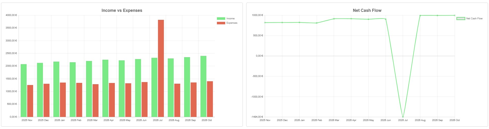
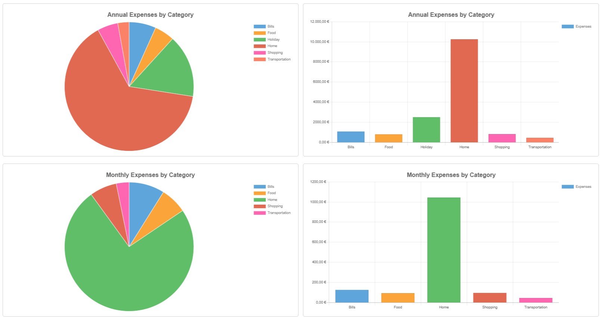
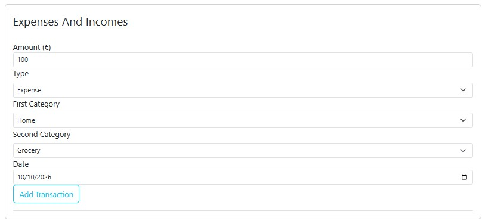
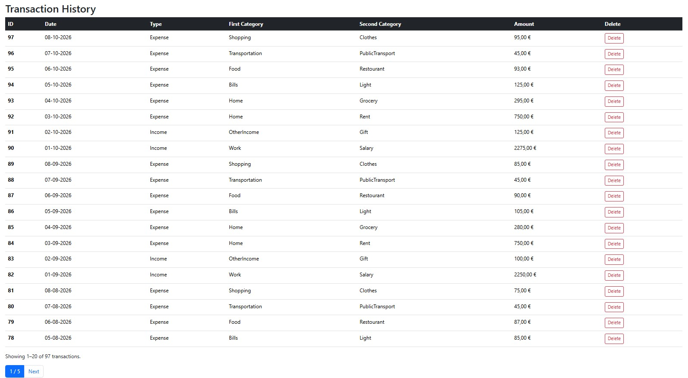

# Personal Finance Manager

A Flask application for recording personal income and expenses and exploring financial reports.

Transactions are stored in a local SQLite database. Monetary values are stored as integer cents and displayed in euros.

## Features

- Record income and expense transactions with a date, category and subcategory.
- Enter positive amounts using a decimal point or comma, such as `12.50` or `12,50`.
- View transaction history, ordered by date and ID, with 20 transactions per page.
- Delete transactions using POST requests protected by CSRF tokens.
- Compare income, expenses and net cash flow over the last twelve calendar months, including the current month.
- Explore monthly and annual category reports for a selected year and month.
- Validate category relationships and show form errors.
- Roll back failed database writes and log errors.

Expense reports group transactions by primary category. Income reports group transactions by subcategory. The year/month filter changes the category reports; the twelve-month charts remain anchored to the current month.

## Requirements

- Python 3.12.
- Git, if cloning the repository.

Runtime dependencies are pinned in `requirements.txt`. Development dependencies, including Ruff, are defined in `requirements-dev.txt`.

## Installation on Windows

Run the following commands in PowerShell. After cloning, run all subsequent commands from the project root.

### 1. Clone the repository

```powershell
git clone https://github.com/PSueri/personal-finance-manager.git
cd personal-finance-manager
```

### 2. Create a virtual environment and install dependencies

```powershell
python -m venv venv
.\venv\Scripts\python.exe -m pip install -r requirements.txt
```

The commands below use the virtual environment's Python directly, so activation is not required.

### 3. Configure the secret key

Generate a key:

```powershell
.\venv\Scripts\python.exe -c "import secrets; print(secrets.token_hex(32))"
```

Copy the generated value and set it in the same terminal:

```powershell
$env:SECRET_KEY = "PASTE_YOUR_GENERATED_KEY_HERE"
```

Flask uses this key to sign sessions and CSRF tokens. Keep it private and reuse the same value across application restarts. Do not commit it to the repository.

This command sets the variable only for the current PowerShell session. Configure it again when opening a new terminal, or use the environment configuration of your IDE.

### 4. Create or update the database

```powershell
.\venv\Scripts\python.exe -m flask --app application:create_app db upgrade
```

This command applies the committed migrations, creating the database and its
tables on the first run. If the database is already up to date, no schema
changes are applied.

On the first run, the output includes a message similar to:

```text
INFO [alembic.runtime.migration] Running upgrade -> 47a4346290ab, Create initial transaction schema
```

The SQLite database is stored in `instance/Transazioni_cents.db` by default.

Run this command again after pulling changes that include new migrations.

### 5. Start the application

```powershell
.\venv\Scripts\python.exe -m flask --app application:create_app run --port 8080
```

Open [http://127.0.0.1:8080](http://127.0.0.1:8080).

For development, add `--debug` to the command to enable automatic reloads and debugging. These commands use Flask's development server.

## Installation on Linux or macOS

Clone the repository and enter the project directory, then run:

```bash
python3 -m venv venv
venv/bin/python -m pip install -r requirements.txt
venv/bin/python -c "import secrets; print(secrets.token_hex(32))"
```

Copy the generated key into the environment variable and continue in the same terminal:

```bash
export SECRET_KEY="PASTE_YOUR_GENERATED_KEY_HERE"
venv/bin/python -m flask --app application:create_app db upgrade
venv/bin/python -m flask --app application:create_app run --port 8080
```

The same database and secret-key behavior described above applies.

## Running with PyCharm

1. Select the project's virtual environment as the Python interpreter.
2. Create a Python Run configuration for `run.py`.
3. Set the working directory to the project root.
4. Add `SECRET_KEY` with your generated value under **Environment variables**.
5. Initialize the database using the terminal commands above, then run the configuration.

The Run configuration, integrated Terminal and Python Console have separate environment settings. A key configured for Run is not automatically available in the Terminal or Python Console.

Commands such as `python -m flask ...` belong in the Terminal. The Python Console accepts Python code, not shell commands.

## Development checks

Install development dependencies:

```powershell
.\venv\Scripts\python.exe -m pip install -r requirements-dev.txt
```

Run the linter and tests from the project root:

```powershell
.\venv\Scripts\python.exe -m ruff check .
.\venv\Scripts\python.exe -m ruff format --check .
.\venv\Scripts\python.exe -m unittest discover -s tests -t . -v
```

On Linux or macOS, replace `.\venv\Scripts\python.exe` with `venv/bin/python`.

The tests create their own application configurations and use in-memory SQLite databases where database access is required. They do not require your personal `SECRET_KEY` or modify the local transaction database.

The suite covers monetary conversion and display, form validation, reporting periods and totals, transaction routes, CSRF protection, pagination, database write failures, and application/database initialization.

To apply available automatic lint fixes:

```powershell
.\venv\Scripts\python.exe -m ruff check . --fix
.\venv\Scripts\python.exe -m ruff format .
```

Review the changes and rerun the checks afterwards. Ruff configuration is stored in `pyproject.toml`.

## Continuous integration

The workflow in `.github/workflows/tests.yml` runs on pushes, pull requests and manual dispatches. It uses Python 3.12 on Ubuntu to:

1. Install development dependencies.
2. Check dependency compatibility with `pip check`.
3. Run Ruff.
4. Run the unittest suite.

View results in the repository's **Actions** tab.

## Project organization

| File or directory | Responsibility |
| --- | --- |
| `run.py` | Create and run the application. |
| `application/__init__.py` | Application factory, configuration, extension initialization, template filters and CLI commands. |
| `application/extensions.py` | Shared SQLAlchemy and CSRF extension objects. |
| `application/routes.py` | Blueprint routes, request handling and responses. |
| `application/models.py` | Transaction database model. |
| `application/forms.py` | Input conversion and validation. |
| `application/categories.py` | Shared category and subcategory definitions. |
| `application/money.py` | Conversion of input to cents and formatting for display. |
| `application/reporting.py` | Reporting queries and financial aggregates. |
| `application/templates/` | Jinja page templates. |
| `application/static/js/` | Dashboard charts and dependent category menus. |
| `tests/` | Unit and integration tests, with shared database setup in `base.py`. |
| `instance/` | Local database files; excluded from version control. |

## Screenshots

### Financial dashboard

The dashboard compares income and expenses and displays net cash flow over twelve months.



Category reports include pie and bar charts for expenses and income, with monthly and annual summaries.



Use the year/month controls to select the period for category reports.


### Add a transaction

Enter an amount, select Income or Expense, choose a category and subcategory, and provide the transaction date.



### Transaction history

The history displays each transaction's ID, date, type, category, subcategory and amount, with a delete action and pagination.


